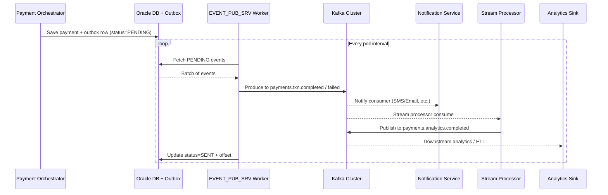

# CoreBank Payment - Kafka Architecture & Operations

## 1. Purpose & Scope
- Mở rộng luồng thanh toán Tuxedo bằng nền tảng sự kiện giúp cung cấp realtime analytics, notification và tích hợp đối tác mà không chỉnh sửa logic Pro*C.
- Tài liệu mô tả cách Kafka được dùng trong dự án, bao gồm publisher (outbox), topic, stream processor, consumer, triển khai và vận hành.

## 2. Event Flow Overview

## 3. Kafka Topics & Contracts
| Topic | Producer | Consumers | Payload | Ghi chú |
|-------|----------|-----------|---------|---------|
| `payments.txn.completed` | Outbox worker (`OutboxRelay`) | Notification service, stream processor, reconciliation jobs | `PaymentEventPayload` (AsyncAPI) | Sự kiện giao dịch thành công |
| `payments.txn.failed` | Outbox worker | Monitoring, alerting, reconciliation | `PaymentEventPayload` | Sự kiện giao dịch thất bại |
| `payments.analytics.completed` | Stream processor (Kafka Streams) | Data landing zone, BI dashboards | `PaymentAnalyticsPayload` (AsyncAPI) | Sự kiện enrich thêm `processedAt`, `amountMinor` |

Schemas được quản lý qua schema registry (xem addendum Mục 3). Producer sử dụng key = `eventId` để duy trì ordering per payment.

## 4. Producer & Consumer Components
- **Outbox Relay (`com.corebank.payment.infrastructure.outbox.OutboxRelay`):**
  - Polls 20 bản ghi PENDING mỗi chu kỳ (default 2s), sử dụng idempotent producer (`acks=all`, retry cao).
  - Khi gửi thành công ghi `status=SENT`, lưu offset, log NAMNM `kafka-success`.
  - Khi lỗi chuyển `status=FAILED`, tăng `retry_count`, alert qua Prometheus và Grafana.
- **Logging fallback (`LoggingPaymentEventPublisher`):** kích hoạt khi `payment.events.kafka-enabled=false` để tránh lỗi dev.
- **Kafka publisher (`KafkaPaymentEventPublisher`):** bật khi `PAYMENT_EVENTS_KAFKA_ENABLED=true`, gửi tới topic theo `eventType`.
- **Stream processor (`com.corebank.payment.stream.*`):**
  - Đọc `payments.txn.completed`, enrich payload, ghi `payments.analytics.completed`.
  - Bật qua `PAYMENT_STREAMS_ENABLED=true` hoặc profile `streams` (file `application-streams.yml`).
  - Chạy độc lập với orchestrator để scale chuyên biệt.
- **Downstream consumers:** Notification service, ETL/sink connector, analytic jobs sẽ subscribe tuỳ mục đích.

## 5. Deployment & Configuration
### 5.1 Kafka Cluster
- Môi trường sản xuất: Kafka 3-5 node, Replication Factor ≥3, ZooKeeper (hoặc KRaft khi nâng cấp), MirrorMaker 2 cho DR.
- Dev/Lab: `scripts/start_kafka.sh` dựng stack Docker (Zookeeper + Kafka) và tạo topic cần thiết (bao gồm `payments.analytics.completed`).
- Bootstrap server mặc định `localhost:9092` có thể override bằng `KAFKA_BOOTSTRAP_SERVERS`.

### 5.2 Application Flags
| Flag/Property | Ý nghĩa |
|---------------|---------|
| `PAYMENT_EVENTS_KAFKA_ENABLED` | Bật producer thật trong orchestrator (default false) |
| `PAYMENT_STREAMS_ENABLED` | Bật stream processor trong cùng JVM (rare) |
| `application-streams.yml` profile `streams` | Chạy app stream độc lập, `processing.guarantee=exactly_once_v2` |

### 5.3 Chạy dịch vụ stream processor
1. Khởi động Kafka (`./scripts/start_kafka.sh`).
2. Trong một terminal khác: `mvn spring-boot:run -Dspring-boot.run.main-class=com.corebank.payment.stream.PaymentEventStreamApplication -Dspring-boot.run.profiles=streams`.
3. Dừng bằng `Ctrl+C`; Kafka Streams sẽ shutdown graceful.

## 6. Reliability & Operations
- **Exactly-once semantics:** producer idempotent + outbox đảm bảo ít nhất một lần; Kafka Streams dùng `exactly_once_v2` để tránh duplicated analytics.
- **Schema compatibility:** enforce `BACKWARD` trong schema registry; CI sử dụng `sr compatibility` check.
- **Monitoring:**
  - Lag & throughput: JMX exporter hoặc Micrometer + Prometheus (`kafka_server_brokertopicmetrics_messages_in_total`, `kafka_consumer_lag`).
  - Outbox metrics: `outbox.retry.total`, `outbox.failed.total`, `outbox.lag.seconds`.
  - Stream processor: trạng thái task, exception log NAMNM, consumer lag.
- **Alerting:**
  - Lag > 60s, `FAILED` tăng, producer error (NAMNM log + Alertmanager rule).
  - Topic retention policy phù hợp với SLA lưu trữ (ví dụ 7 ngày cho txn.*).
- **Failover:** khi Kafka down, outbox giữ PENDING; worker retry theo backoff. Sau khi Kafka lên, worker publish lại.

## 7. Local Testing Checklist
1. `./scripts/start_kafka.sh`
2. `PAYMENT_EVENTS_KAFKA_ENABLED=true mvn spring-boot:run`
3. Gửi thanh toán (`./scripts/test_payment_flow.sh`)
4. Dùng console consumer: `docker compose -f scripts/kafka-compose.yml exec kafka kafka-console-consumer --bootstrap-server localhost:9092 --topic payments.txn.completed --from-beginning`
5. (Tuỳ chọn) Chạy stream processor bằng profile `streams` và đọc topic `payments.analytics.completed`.

## 8. References
- `docs/corebank_tuxedo_payment_solution.md`
- `docs/corebank_tuxedo_payment_operational_addendum.md`
- `docs/payment-asyncapi.yaml`
- `scripts/start_kafka.sh`
- `src/main/java/com/corebank/payment/infrastructure/outbox/**`
- `src/main/java/com/corebank/payment/stream/**`
